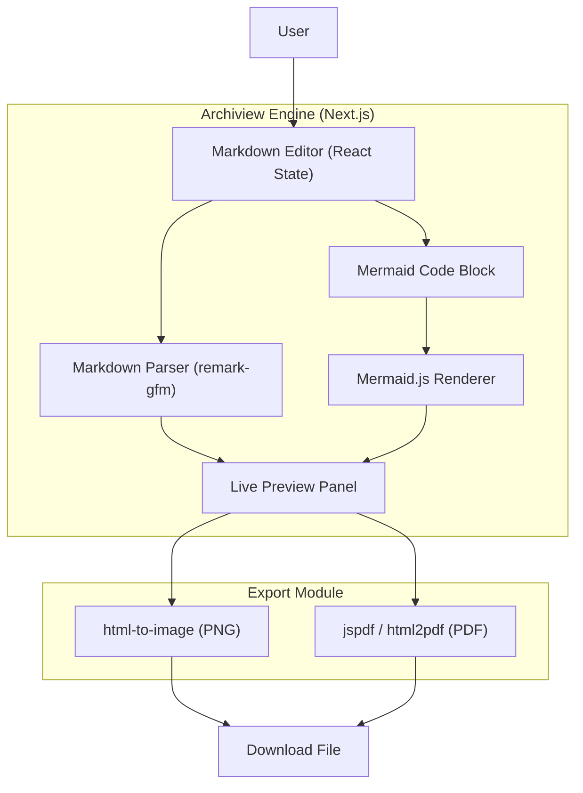

# 📝 Archiview — Modern Markdown & Mermaid Editor


**Archiview** is a sleek, highly-responsive Markdown editor built with modern web technologies. It empowers developers and writers to seamlessly craft documentation, take notes, and build complex architectural diagrams using Mermaid.js—all in a live-rendering environment.

Unlike basic text editors, Archiview acts as a **visual documentation engine**, allowing you to export your work directly to high-quality PDFs or images.

---

## ⚡ Key Features

- **🚀 Live Markdown Rendering**: Instantly visualize your markdown with GitHub Flavored Markdown (GFM) support.
- **📊 Mermaid Diagram Engine**: Natively embed and render complex flowcharts, sequence diagrams, and architecture graphs using Mermaid.
- **📄 Rich Export Options**: Export your documents and diagrams directly to **PDF** or **Image** formats with a single click.
- **🎨 Modern UI/UX**: Crafted with Tailwind CSS and Lucide React icons for a beautiful, distraction-free writing experience.
- **⚡ High Performance**: Built on top of Next.js for lightning-fast rendering and optimal performance.

---

## 🏗️ Architecture



---

## 🧰 Technology Stack

| Component | Responsibility | Technology |
| :--- | :--- | :--- |
| **Framework** | Core application engine & routing | Next.js (React) |
| **Styling** | UI design system & responsive layouts | Tailwind CSS |
| **Markdown** | Parsing and rendering markdown content | `react-markdown`, `remark-gfm` |
| **Diagrams** | Rendering architectural diagrams | `mermaid` |
| **Export** | Generating PDFs and images | `jspdf`, `html2pdf.js`, `html-to-image` |
| **Icons** | Clean and consistent iconography | `lucide-react` |

---

## 🚀 Getting Started

### Prerequisites
- Node.js 18+ 
- npm, yarn, pnpm, or bun

### Installation

1. **Clone the repository**
   ```bash
   git clone https://github.com/pd241008/Archiview.git
   cd Archiview/frontend
   ```

2. **Install dependencies**
   ```bash
   npm install
   # or yarn install, pnpm install
   ```

3. **Run the development server**
   ```bash
   npm run dev
   ```

4. **Open the application**
   Navigate to [http://localhost:3000](http://localhost:3000) in your browser.

---

## 🤝 Contributing
Contributions are welcome! Please feel free to submit a Pull Request.
